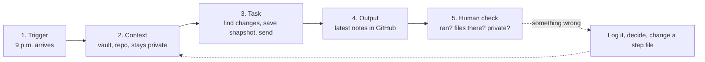

# Vault Sync: Step by Step

This is the "show" diagram: the whole workflow from start to output, in one picture.

```mermaid
flowchart LR
    A["1. Trigger<br>9 p.m. arrives"] --> B["2. Context<br>vault, repo, stays private"]
    B --> C["3. Task<br>find changes, save snapshot, send"]
    C --> D["4. Output<br>latest notes in GitHub"]
    D --> E["5. Human check<br>ran? files there? private?"]
    E -. "something wrong" .-> F["Log it, decide, change a step file"]
    F -.-> B
```

**Model does:** Steps 1 to 4.
**I do:** Step 5, and every fix after it.
