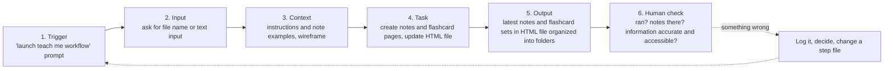

```mermaid
flowchart LR
    A["1. Trigger<br>'launch teach me workflow' prompt"] --> B["2. Input<br>ask for file name or text input"]
    B--> C["3. Context<br>instructions and note examples, wireframe"]
    C --> D["4. Task<br>create notes and flashcard pages, update HTML file"]
    D --> E["5. Output<br>latest notes and flashcard sets in HTML file organized into folders"]
    E --> F["6. Human check<br>ran? notes there? information accurate and accessible?"]
    F -. "something wrong" .-> G["Log it, decide, change a step file"]
    G -.-> A
```

**Model does:** Steps 1 to 5.
**I do:** Step 6, and every fix after it.